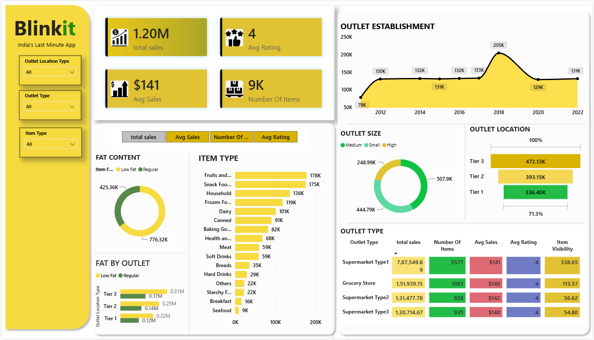

# Grocery Retail Sales Analytics Dashboard

A Power BI data visualization project that analyzes grocery retail sales performance across products, categories, outlet types, outlet locations, and other business dimensions.

This project uses a publicly available grocery/retail sales dataset for educational and analytical purposes and presents the data through an interactive Power BI dashboard.

## Dashboard Preview

> Add your dashboard screenshot here.



## Project Overview

The goal of this project is to transform retail sales data into an interactive and easy-to-understand business intelligence dashboard using Microsoft Power BI.

The dashboard provides an overview of sales performance and allows analysis across different product and outlet characteristics.

## Key Features

- Sales performance analysis
- Product category analysis
- Outlet performance analysis
- Outlet type comparison
- Outlet location analysis
- Item visibility analysis
- Item fat-content analysis
- Customer rating analysis
- Outlet establishment year analysis
- Interactive Power BI visualizations
- Interactive filtering and slicing
- KPI-based dashboard overview

## Dataset

The project uses a publicly available grocery/retail sales dataset containing information about products, outlets, sales, visibility, ratings, and other attributes.

### Dataset Fields

| Field | Description |
|---|---|
| Item Fat Content | Fat-content classification of the item |
| Item Identifier | Unique identifier for the item |
| Item Type | Product category/type |
| Outlet Establishment Year | Year the outlet was established |
| Outlet Identifier | Unique identifier for the outlet |
| Outlet Location Type | Outlet location tier |
| Outlet Size | Size classification of the outlet |
| Outlet Type | Type of retail outlet |
| Item Visibility | Visibility measure of the item |
| Item Weight | Weight of the item |
| Sales | Sales value |
| Rating | Item/outlet rating |

## Tools & Technologies

- **Microsoft Power BI**
- **Power Query**
- **DAX**
- **Data Visualization**
- **Data Cleaning & Transformation**

## Dashboard Analysis

The dashboard focuses on the following areas:

### Sales Analysis

Analysis of overall sales performance across different product and outlet dimensions.

### Product Analysis

Analysis of product categories and item characteristics to understand their relationship with sales.

### Outlet Analysis

Comparison of sales across outlet types, sizes, locations, and establishment years.

### Customer Rating Analysis

Analysis of ratings alongside sales and other available business attributes.

## Project Structure

```text
powerbi-portfolio/
│
├── projects/
│   └── 01-grocery-retail-sales/
│       │
│       ├── Grocery_Retail_Sales_Analytics.pbix
│       │
│       ├── screenshots/
│       │   └── dashboard.png
│       │
│       └── README.md
│
└── README.md
```

## How to Open the Dashboard

### Requirements

- Microsoft Power BI Desktop

### Steps

1. Clone this repository:

```bash
git clone https://github.com/YOUR_USERNAME/powerbi-portfolio.git
```

2. Navigate to the project directory:

```bash
cd powerbi-portfolio/projects/01-grocery-retail-sales
```

3. Open:

```text
Grocery_Retail_Sales_Analytics.pbix
```

4. Open the file using **Microsoft Power BI Desktop**.

## Usage

After opening the Power BI file:

1. Explore the dashboard overview.
2. Use available slicers and filters.
3. Interact with charts and visualizations.
4. Compare sales across products and outlets.
5. Analyze different retail dimensions.
6. Explore the dashboard pages and visual insights.

## Project Purpose

This project was created as a **data visualization and business intelligence portfolio project** to demonstrate practical experience with:

- Power BI
- Data visualization
- Power Query
- DAX
- Business analytics
- Dashboard design
- Data-driven analysis

## Dataset Attribution

The dataset used in this project is a publicly available grocery/retail sales dataset commonly used for educational and analytical purposes.

The project does not claim that the dataset represents proprietary or internal sales data from any specific company.

If the original dataset source requires attribution or has specific redistribution restrictions, refer to the original dataset source and its applicable license before redistributing the raw dataset.

## License

This project is provided for educational and portfolio purposes.

The Power BI report and project documentation are provided under the terms of the repository license.

The dataset may be subject to its original source's license and usage conditions. The dataset license should be checked separately before redistribution.

## Author

**Pranay Patil**

GitHub: [Pranay-Pandurang-Patil](https://github.com/Pranay-Pandurang-Patil)

## Future Improvements

- Add additional dashboard pages
- Improve KPI and business metrics
- Add deeper product-level analysis
- Add more interactive filtering
- Add additional Power BI projects to this portfolio

## Related Projects

This repository is intended to contain multiple Power BI projects.

```text
01 - Grocery Retail Sales Analytics
02 - Coming Soon
03 - Coming Soon
04 - Coming Soon
```